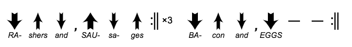

# Bodhrán Typesetter

Some Javascript for including Bodhrán sticking and rhythm diagrams on web
pages. Using this it's fairly easy to produce things like this:



Further live examples at https://jw35.github.io/bodhran-typesetter/

## Usage

1. Include `bodhran-typesetter.js` in you html page:

```
    <script src="bodhran-typesetter.js"></script>
```

2. Add one or more HTML elements to your page with
   `class="notation"` (both block-level elements like `<div>`
   	and in-line elements like `<span>` should work:

```
    <div class="notation">
    </div>
```

3. Make the body of the element a notation string as described below:

```
    <div class="notation">
       Dudu, Dudu |
    </div>
```

The Javascript will process each such element, replace its content with
a canvas element and draw an appropriate diagram on it.

The canvas is sized to more-or-less exactly hold the diagram with no margin
around it. You will probably want to add some padding or margins either to to canvas itself or
to an element containing it. The canvas is tagged with `class="diagram"` so
it can be targeted with CSS.

You can alter the overall size of the notation diagram by assigning to
`BodhranTypesetter.scale_factor`, after loading `bodhran-typesetter.js`. e.g.

```
    <script src="bodhran-typesetter.js"></script>
    <script>
        BodhranTypesetter.scale_factor = 0.5;
    </script>
```

At a scale factor of 1.0, the arrows in the diagrams are about 60px high.
The default scale factor is 0.5.

If you don't like the way this automatically locates elements to process
and reads the notation out of their bodies then you can just create your own canvas
elements and pass them along with notation
strings and a scale factors to `BodhranTypesetter.display_notation(canvas, notation, scale_factor)`.

## Notation

Notations consist of characters in a scheme vaguely
inspired by [ABC Notation](http://abcnotation.com/).

A line break in the input produces a line break in the generated output and
there's no way to escape this. White space and blank lines are otherwise
ignored in notations and can be used freely to improve readability. There's no
line or page wrapping - the canvas element will be made as wide and as high as
is needed to display the notation provided. How this will display or print is
up to the browser.

The characters recognised in the notation are:

Character | Symbol
:-------: | ------
d | Downstroke
u | Upstroke
s | Stab
D | Strong downstroke
U | Strong upstroke
S | Strong stab
\- | Dash
\| | Bar
! | Thin-thin double bar
Z or z | Thin-thick double bar ('z' = 'end')
: | Start repeat
X or x | End repeat ('x' = 'times')
X\<n\> or x\<n\> | End repeat **n** times (**n** must be a number)
, | Comma
\# | Half-width space
b | Negative half-width space ('b' = 'back')
3 | Negative one-thirds space ('3' = 'thirds')
\+ | Triplet made up of the previous and next symbol
T\<b\>/\<u\> | Time signature **b/u** (**b** and **u** must be numbers)
t\<b\>/\<u\> | Invisible time signature **b/u** (for alignment, **b** and **u** must be numbers)
"\<text\>" | Display **text** as annotation above or below the next symbol. If text starts '^' it is displayed above; if it starts '_' it is displayed below; if neither then it is currently displayed below.
^ | Display following symbols raised
_ | Display following symbols lowered ('underscore', not 'minus')
= | Display following symbols centred (default)

* There's no attempt to stop annotations overlapping. Further, the triplet notation and
annotations above the symbols use the same space and so can't be used together.

* If any symbols are raised or lowered then a centerline is automatically drawn
to make it easier to see their relationship.

* There is next to no error checking. Syntactically-valid notations will
(should) produce the expected diagrams; anything else might do anything,
including throwing Javascript exceptions which will prevent some or all
subsequent notation from displaying. Your browser's Javascript error log may throw
some light on what has gone wrong.

## Contributing

I wrote this for my own benefit. It supports the features I want and might be
extended in the future if I need other things. Suggestions, or (better) pull requests
are welcome, but I reserve the right to ignore them if it suites me.
